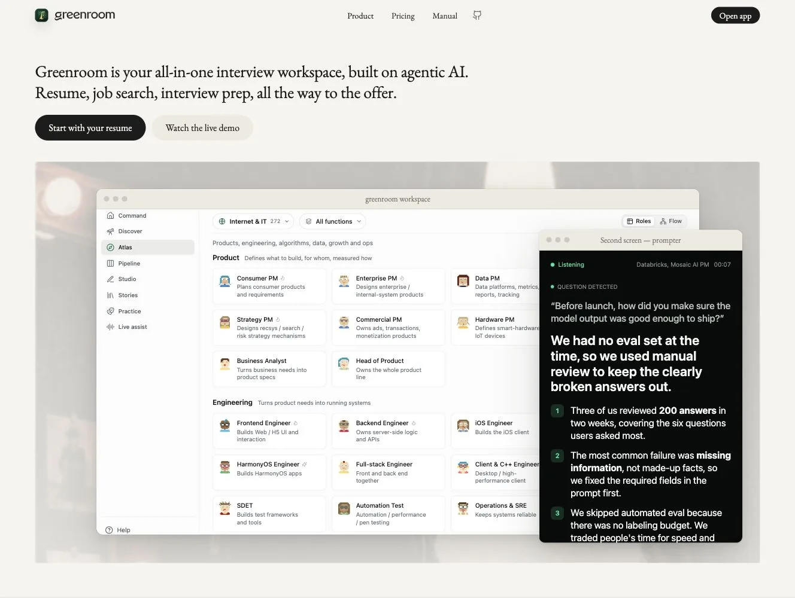
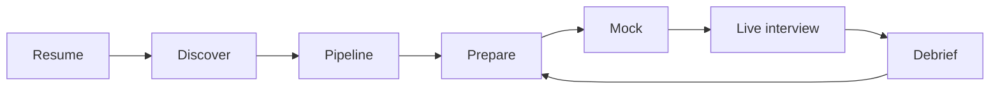
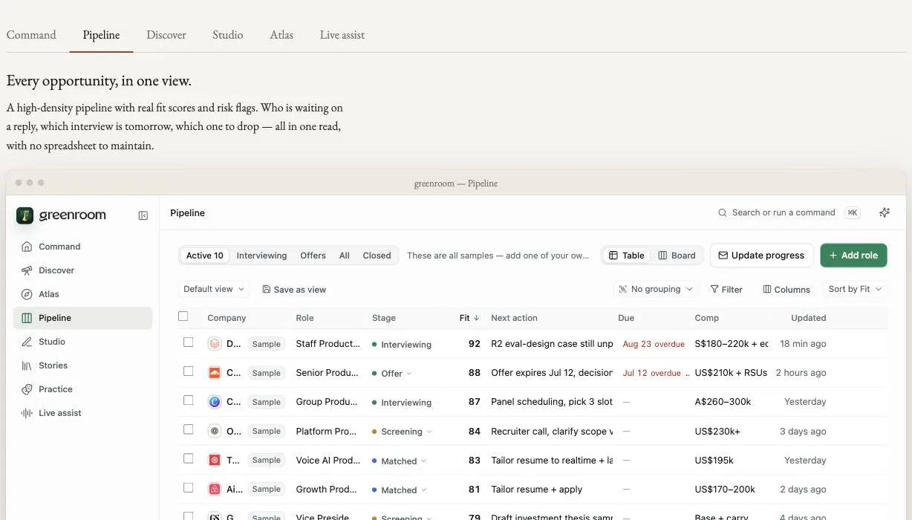
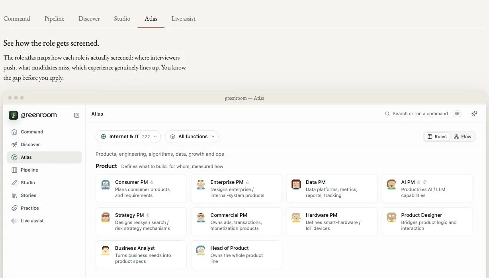
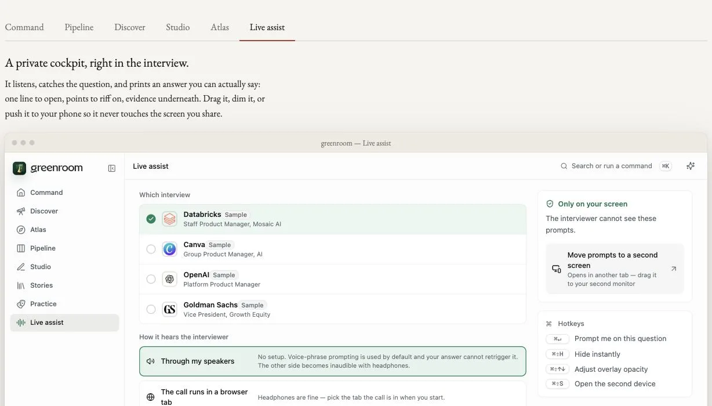

<div align="center">

<a href="https://greenroom.ungetsu.net/">
  
</a>

# greenroom · 候场

**Turn a scattered job hunt into one connected system—from your resume to the offer.**

Greenroom does not leave you in an empty chat box. It tracks opportunities, checks the facts, shapes your stories, rehearses the pressure,<br>
and carries answers you can actually say into the interview itself.

[](https://greenroom.ungetsu.net/)
[](LICENSE)

**[Start with your resume →](https://greenroom.ungetsu.net/)** · [Watch the live demo](https://greenroom.ungetsu.net/#work) · [Install core in 30 seconds](#put-your-agent-to-work-in-30-seconds) · [中文](README.zh-CN.md)

</div>

<a href="https://greenroom.ungetsu.net/">
  
</a>

<p align="center"><sub>Not a concept render. This is the running Greenroom product with fictional demo data: the full job-search workspace on the left and private second-screen prompts on the right.</sub></p>

| **Official product** | **Open core** |
| :--- | :--- |
| 1,443 role profiles across 43 industries; one workspace from discovery to the live interview | 7 Agent Skills and 163 deep role entries; an open Markdown workspace contract |

## The hard part is not getting advice. It is making every step connect.

Saved roles live in a spreadsheet. Resume edits live in a document. Interview answers disappear into chat history. Every tool helps a little, but none of them knows what you should do next.

Greenroom connects the loop. Role judgment changes the resume. Resume facts become reusable stories. Stories become speakable answers. Mock and real-interview feedback flows back into the next round.



## See the opportunity before you spend the time

### Every opportunity gets a stage, a judgment, and a next move

<a href="https://greenroom.ungetsu.net/">
  
</a>

Fit, stage, next action, deadline, and risk signals sit in one view. You are no longer maintaining a spreadsheet that cannot remind you; you are running a pipeline that can move toward an offer.

### Learn how the role screens people before you prepare

<a href="https://greenroom.ungetsu.net/">
  
</a>

The role atlas is not a list of titles. It shows what each role rewards, where interviewers push, and which experience counts as evidence—so you can see the gap before you apply.

### When the interview starts, your preparation stays with you

<a href="https://greenroom.ungetsu.net/">
  
</a>

Live assist catches the question, gives you an opening line, supporting points, and evidence, and can move the prompts to a second display. The prompts stay on your screen and out of the screen you share.

> **Want the complete workflow above, ready to use?** [Open Greenroom and start with your resume →](https://greenroom.ungetsu.net/)<br>
> **Want the method inside your own agent?** Keep reading and install greenroom core.

## Do you want the complete product or the open core?

> [!IMPORTANT]
> **This repository is greenroom core, not a locally deployable edition of the Greenroom product.** The open layer provides Skills, public knowledge, a portable Markdown workspace contract, examples, and file-format tools. It ships no local server or product backend. The full product UI, accounts and sync, hosted model features, metering, and payments are available only through the [official product](https://greenroom.ungetsu.net/).

| | **Official Greenroom** | **greenroom core** |
| --- | --- | --- |
| **Choose it when** | You want a ready-to-use journey from resume and opportunities to mock rounds and live interviews | You want to run the method inside your own agent or build compatible tools |
| **Includes** | Full product UI, account sync, hosted models, live prompting, product-grade mock interviews, ongoing operations | 7 Skills, 163 role entries, the Markdown contract, a demo workspace, and file-format tools |
| **Runs** | On the official managed service; **there is no self-hosted edition** | Skills run in your agent; workspace files live on your computer |
| **Distribution** | Official managed service | AGPL-3.0 source repository |
| **Start** | [Open the product](https://greenroom.ungetsu.net/) | [Install the Skills](#put-your-agent-to-work-in-30-seconds) |

## Put your agent to work in 30 seconds

Install the versioned plugin in Claude Code:

```text
/plugin marketplace add YunyueLi/greenroom
/plugin install greenroom@greenroom
```

Or install it in any tool that supports Agent Skills:

```bash
npx skills add YunyueLi/greenroom
```

Then tell your agent:

> I am interviewing for the AI product manager role at Acme next Tuesday. Here are my resume and the JD. Prepare me end to end.

`greenroom` selects the right Skills and writes a workspace folder. You can also narrow the job:

> Research the role only.<br>
> Turn these three stories into answers I can say out loud.<br>
> Run a second-round mock interview, then give me a coach report.

## Why the output survives a real interview

**Answers, not outlines.** Most prep tools hand you bullet points and leave the hardest step—turning them into complete sentences under pressure—to you. greenroom writes first-person answers meant to be spoken out loud.

**Numbers with definitions; judgments with evidence.** Every important figure in a story should record its scope and source. When an interviewer follows up, you can defend a fact you checked instead of improvising one.

```markdown
Self-service resolution rose from 31% to 52%, while support staffing cost fell 18%.

**Evidence notes**
- 31% → 52%: cases not transferred to an agent and not reopened within 24 hours
- 18%: staffing cost comparison across months using the same scope
```

**Files you own.** Resumes, roles, story cards, scripts, and debriefs are plain Markdown under a published contract. They are inspectable and portable without a proprietary export format.

## Seven Skills, one continuous workflow

| Skill | Output |
| --- | --- |
| [`greenroom`](skills/greenroom/) | Entry point: understands the goal, runs the full pipeline, or routes to one step |
| [`job-intel`](skills/job-intel/) | Deconstructs the JD, researches the company and interviewers, forecasts the next round |
| [`story-bank`](skills/story-bank/) | Mines real experience into reusable story cards with sourced numbers |
| [`industry-brief`](skills/industry-brief/) | Builds the industry, company, and role context needed to sound informed |
| [`interview-script`](skills/interview-script/) | Turns facts and judgment into complete first-person answers you can say out loud |
| [`mock-interview`](skills/mock-interview/) | Plays the interviewer, applies pressure follow-ups, scores the round, writes a coach report |
| [`debrief`](skills/debrief/) | Reconstructs a finished interview and turns feedback into a script revision list |

## The workspace

```text
my-greenroom/
├── profile.md                  # candidate profile
├── resume.md                   # resume fact base
├── story-bank.md               # reusable story cards
├── library/                    # industry briefs, research, reference reading
└── jobs/<company-role>/
    ├── job.md                  # JD and process timeline
    ├── intel.md                # company, interviewers, question forecast
    ├── script.md               # first-person verbatim script
    └── rounds/                 # prep notes, mock reports, debriefs
```

[`examples/demo-workspace/`](examples/demo-workspace/) is a complete example: the format and workflow are real; the people and companies are fictional.

## 163 public role entries, so you do not start cold

[`knowledge/`](knowledge/) currently contains **163 role entries** across **27 function and industry groups**. Entries are organized around real interview judgment: mental models, benchmarks, canonical cases, strong-versus-weak candidate signals, frequent questions, and follow-up chains.

The knowledge base contains no candidate data. `industry-brief` checks it before doing incremental research; every useful public contribution makes the next user's cold start faster.

## Build on the open contract

The workspace format is a published contract, not a Greenroom implementation detail. Compatible tools read files explicitly selected by the user; the repository does not ship an HTTP runtime or probe localhost.

| Resource | Purpose |
| --- | --- |
| [`docs/workspace-spec.md`](docs/workspace-spec.md) | Directory layout, frontmatter, question-card format, and file-reading rules |
| [`docs/realtime-bridge.md`](docs/realtime-bridge.md) | Connect the workspace to a reader, retrieval tool, or your own client |
| [`tools/workspace_codec.py`](tools/workspace_codec.py) | Convert between Markdown workspaces and structured data |

## Open-core boundary

| **This repository includes** | **This repository does not include** |
| --- | --- |
| Agent Skills and preparation methods | The official product UI implementation or brand assets |
| The public role knowledge base | Accounts, cloud sync, metering, or payments |
| The Markdown workspace contract | The hosted model proxy or product backend |
| File-format tools for compatible readers and editors | Any local or hosted Greenroom product backend |
| A fictional demo workspace | A deployable or resellable edition of the Greenroom product |

You may run, modify, and contribute to greenroom core, and build compatible tools on the published contract. You may not present this repository as the official Greenroom product or an official self-hosted edition. See [`TRADEMARK.md`](TRADEMARK.md) for the brand rules. Product screenshots in this README document the official product only; they do not license the depicted UI or services under AGPL-3.0. See the [asset notice](docs/assets/readme/README.md).

## Privacy

A workspace begins as a folder on your computer. What an agent or model provider receives depends on the agent and provider you choose; review their data policies before supplying a real resume, salary details, or private company information.

Never commit real candidate material, API keys, production logs, or undisclosed company information to this repository or any other public repository. Use fictional data in examples and tests.

## Contributing and license

Contributions are welcome for Skills, public role knowledge, contract improvements, examples, and compatibility tools. Read [`CONTRIBUTING.md`](CONTRIBUTING.md) before you start.

greenroom Community Edition is licensed under the [GNU Affero General Public License v3.0](LICENSE). The greenroom name, logo, wordmark, domain, and confusingly similar branding are governed by [`TRADEMARK.md`](TRADEMARK.md).

<div align="center">

**Do not start your next interview from an empty chat box.**

[**Open Greenroom and start with your resume →**](https://greenroom.ungetsu.net/)

[Install greenroom core](#put-your-agent-to-work-in-30-seconds) · [Explore the demo](examples/demo-workspace/) · [Contribute](CONTRIBUTING.md)

</div>
