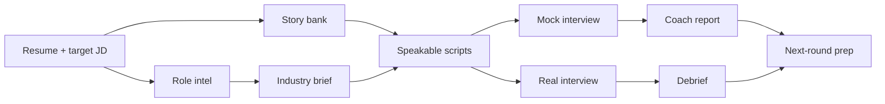

<div align="center">

<a href="https://greenroom.ungetsu.net/">
  
</a>

# greenroom · 候场

**Interview prep that ends in words you can actually say.**

Seven Agent Skills, 163 public role entries, and an open Markdown workspace contract.<br>
Give an agent your resume and target JD; get role intel, a sourced story bank, speakable scripts, mock rounds, and debriefs.

[](https://greenroom.ungetsu.net/)
[](LICENSE)
[](https://github.com/YunyueLi/greenroom/releases)
[](README.zh-CN.md)

[Open the official app](https://greenroom.ungetsu.net/) · [Start in 30 seconds](#start-in-30-seconds) · [Explore the demo](examples/demo-workspace/) · [Read the spec](docs/workspace-spec.md)

</div>

<a href="https://greenroom.ungetsu.net/">
  
</a>

> [!IMPORTANT]
> **This repository is greenroom core, not a self-hostable edition of the Greenroom product.** The open layer provides Skills, public knowledge, the workspace contract, and a read-only reference server. The full product UI, accounts and sync, hosted model features, metering, and payments are available only through the [official product](https://greenroom.ungetsu.net/).

## Choose your route

| | **Official Greenroom** | **greenroom core** |
| --- | --- | --- |
| **Choose it when** | You want a ready-to-use journey from resume and opportunities to mock rounds and live interviews | You want to run the method inside your own agent or build compatible tools |
| **Includes** | Full product UI, account sync, hosted models, live prompting, product-grade mock interviews, ongoing operations | 7 Skills, 163 role entries, the Markdown contract, a demo workspace, a read-only reference server |
| **Runs** | On the official managed service; **there is no self-hosted edition** | Skills run in your agent; workspace files live on your computer |
| **License** | Product layer: all rights reserved | Core: AGPL-3.0 |
| **Start** | [Open the product](https://greenroom.ungetsu.net/) | [Install the Skills](#start-in-30-seconds) |

## Start in 30 seconds

Install the versioned plugin in Claude Code:

```text
/plugin marketplace add YunyueLi/greenroom
/plugin install greenroom@greenroom
```

Or install it in any tool that supports Agent Skills:

```bash
npx skills add YunyueLi/greenroom
```

Then tell your agent:

> I am interviewing for the AI product manager role at Acme next Tuesday. Here are my resume and the JD. Prepare me end to end.

`greenroom` selects the right Skills and writes a workspace folder. You can also narrow the job:

> Research the role only.<br>
> Turn these three stories into answers I can say out loud.<br>
> Run a second-round mock interview, then give me a coach report.

## From resume to the next round



greenroom does not leave its work scattered across chat history. Role changes, mock results, and post-interview notes flow back into the same workspace and become input for the next round.

## Why greenroom

**Answers, not outlines.** Most prep tools hand you bullet points and leave the hardest step — turning them into complete sentences under pressure — to you. greenroom writes first-person answers meant to be spoken out loud.

**Numbers with definitions; judgments with evidence.** Every important figure in a story should record its scope and source. When an interviewer follows up, you can defend a fact you checked instead of improvising one.

```markdown
Self-service resolution rose from 31% to 52%, while support staffing cost fell 18%.

**Evidence notes**
- 31% → 52%: cases not transferred to an agent and not reopened within 24 hours
- 18%: staffing cost comparison across months using the same scope
```

**Files you own.** Resumes, roles, story cards, scripts, and debriefs are plain Markdown under a published contract. They are inspectable and portable without a proprietary export format.

## Seven Skills

| Skill | Output |
| --- | --- |
| [`greenroom`](skills/greenroom/) | Entry point: understands the goal, runs the full pipeline, or routes to one step |
| [`job-intel`](skills/job-intel/) | Deconstructs the JD, researches the company and interviewers, forecasts the next round |
| [`story-bank`](skills/story-bank/) | Mines real experience into reusable story cards with sourced numbers |
| [`industry-brief`](skills/industry-brief/) | Builds the industry, company, and role context needed to sound informed |
| [`interview-script`](skills/interview-script/) | Turns facts and judgment into complete first-person answers you can say out loud |
| [`mock-interview`](skills/mock-interview/) | Plays the interviewer, applies pressure follow-ups, scores the round, writes a coach report |
| [`debrief`](skills/debrief/) | Reconstructs a finished interview and turns feedback into a script revision list |

## The workspace

```text
my-greenroom/
├── profile.md                  # candidate profile
├── resume.md                   # resume fact base
├── story-bank.md               # reusable story cards
├── library/                    # industry briefs, research, reference reading
└── jobs/<company-role>/
    ├── job.md                  # JD and process timeline
    ├── intel.md                # company, interviewers, question forecast
    ├── script.md               # first-person verbatim script
    └── rounds/                 # prep notes, mock reports, debriefs
```

[`examples/demo-workspace/`](examples/demo-workspace/) is a complete example: the format and workflow are real; the people and companies are fictional.

## The public role knowledge base

[`knowledge/`](knowledge/) currently contains **163 role entries** across **27 function and industry groups**. Entries are organized around real interview judgment: mental models, benchmarks, canonical cases, strong-versus-weak candidate signals, frequent questions, and follow-up chains.

The knowledge base contains no candidate data. `industry-brief` checks it before doing incremental research; every useful public contribution makes the next user's cold start faster.

## Build on the open contract

The workspace format is a published contract, not a Greenroom implementation detail. Compatible tools can read the files directly or use the repository's reference server to read the same data.

| Resource | Purpose |
| --- | --- |
| [`docs/workspace-spec.md`](docs/workspace-spec.md) | Directory layout, frontmatter, question-card format, and HTTP read contract |
| [`docs/realtime-bridge.md`](docs/realtime-bridge.md) | Connect the workspace to a reader, retrieval tool, or your own client |
| [`serve.py`](serve.py) | Read-only reference server built on the Python standard library |
| [`tools/workspace_codec.py`](tools/workspace_codec.py) | Convert between Markdown workspaces and structured data |

```bash
git clone https://github.com/YunyueLi/greenroom.git
cd greenroom
./start.sh ~/my-greenroom
```

The reference server listens only on `127.0.0.1:8765` and exposes workspace read endpoints. It has no product UI, account system, or model-generation endpoint, and needs no API key.

## Open-core boundary

| **This repository includes** | **This repository does not include** |
| --- | --- |
| Agent Skills and preparation methods | The official product UI or brand assets |
| The public role knowledge base | Accounts, cloud sync, metering, or payments |
| The Markdown workspace contract | The hosted model proxy or product backend |
| A read-only reference server and compatibility tools | Server endpoints for live prompting, product-grade mock scoring, or one-pass generation |
| A fictional demo workspace | A deployable or resellable edition of the Greenroom product |

You may run, modify, and contribute to greenroom core, and build compatible tools on the published contract. You may not present this repository as the official Greenroom product or an official self-hosted edition. See [`TRADEMARK.md`](TRADEMARK.md) for the brand rules.

## Privacy

A workspace begins as a folder on your computer. What an agent or model provider receives depends on the agent and provider you choose; review their data policies before supplying a real resume, salary details, or private company information.

Never commit real candidate material, API keys, production logs, or undisclosed company information to this repository or any other public repository. Use fictional data in examples and tests.

## Contributing and license

Contributions are welcome for Skills, public role knowledge, contract improvements, examples, and compatibility tools. Read [`CONTRIBUTING.md`](CONTRIBUTING.md) before you start.

greenroom Community Edition is licensed under the [GNU Affero General Public License v3.0](LICENSE). The greenroom name, logo, wordmark, domain, and confusingly similar branding are governed by [`TRADEMARK.md`](TRADEMARK.md).

<div align="center">

**Prepare every word before you go on stage.**

[Open the official app](https://greenroom.ungetsu.net/) · [Install greenroom core](#start-in-30-seconds) · [Contribute](CONTRIBUTING.md)

</div>
