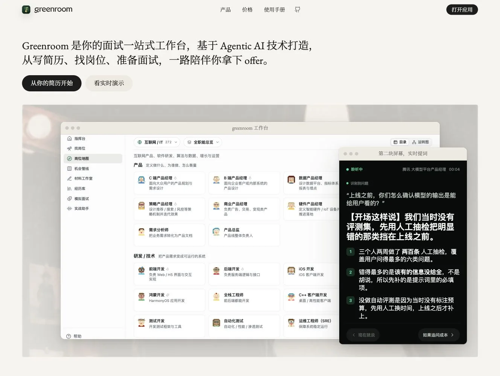
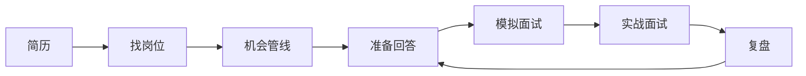
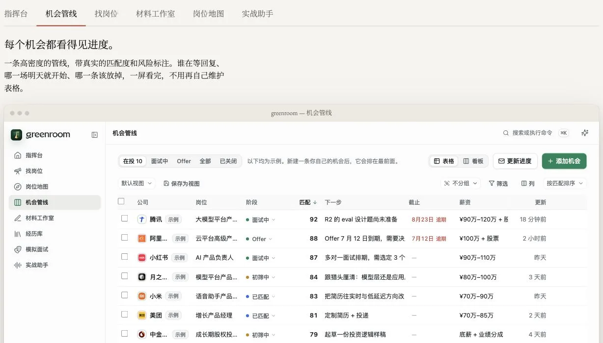
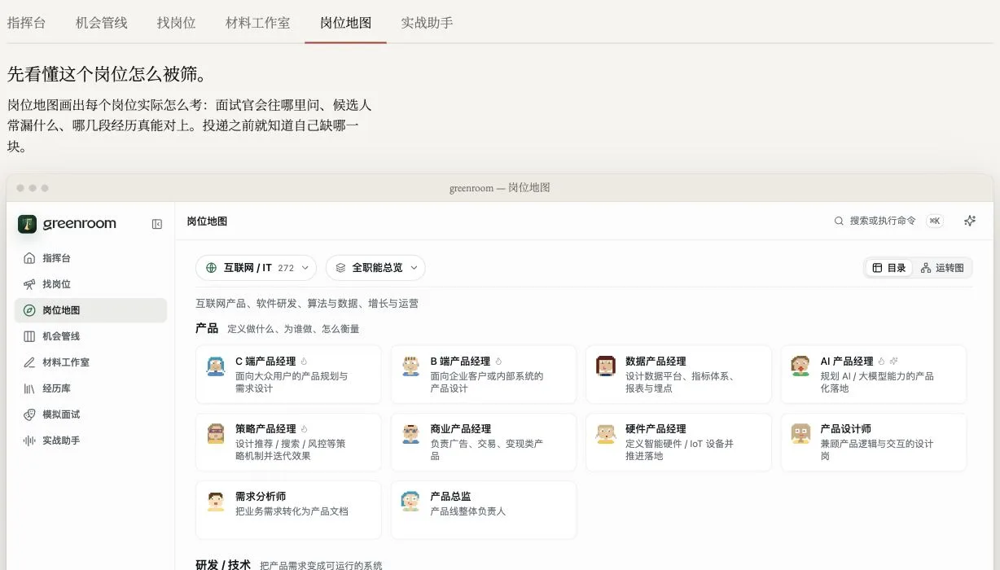
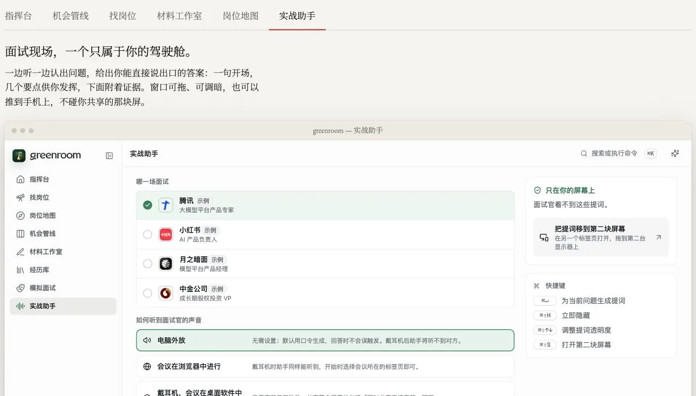

<div align="center">

<a href="https://greenroom.ungetsu.net/">
  
</a>

# greenroom · 候场

**把散落的简历、岗位、回答和复盘，变成一条从简历到 offer 的行动系统。**

Greenroom 不把你留在一个空白聊天框里。它跟踪机会、核对事实、组织经历、陪你模拟，<br>
再把真正能说出口的答案带进面试现场。

[](https://greenroom.ungetsu.net/)
[](LICENSE)

**[从你的简历开始 →](https://greenroom.ungetsu.net/)** · [看实时演示](https://greenroom.ungetsu.net/#work) · [30 秒安装 core](#30-秒让-agent-开始工作) · [English](README.md)

</div>

<a href="https://greenroom.ungetsu.net/">
  
</a>

<p align="center"><sub>不是概念图：上图来自正在运行的 Greenroom 官方产品，使用虚构演示数据。左侧是完整求职工作台，右侧是只在你屏幕上显示的第二屏提示。</sub></p>

| **官方产品** | **开源 core** |
| :--- | :--- |
| 1,443 个岗位画像，覆盖 43 个行业；从找岗位到实战共用一个工作台 | 7 个 Agent Skills，163 个深度岗位条目；开放 Markdown 工作台契约 |

## 一次求职，最难的不是得到建议。是让每一步接得上。

职位收藏在表格里，简历改在文档里，面试答案散落在聊天记录里——每个工具都做了一点，但没有谁知道你下一步该做什么。

Greenroom 把它们接成同一条反馈闭环：岗位判断决定简历重点，简历事实进入经历库，经历库生成可朗读回答，模拟和真实面试的反馈再回到下一轮。



## 先看清机会，再决定把时间花在哪里

### 每个机会，都有进度、判断和下一步

<a href="https://greenroom.ungetsu.net/">
  
</a>

匹配度、当前阶段、下一动作、截止日期和风险信号都在一个视图里。你不再维护一张不会提醒你的表格，而是在经营一条真正会向 offer 推进的机会管线。

### 先知道岗位怎样筛人，再开始准备

<a href="https://greenroom.ungetsu.net/">
  
</a>

岗位地图不是职位名称列表。它说明每类岗位真正看重什么、面试官会在哪里追问、什么经历能形成证据，让你在投递前就看见差距。

### 面试开始后，准备仍然跟得上你

<a href="https://greenroom.ungetsu.net/">
  
</a>

实战助手听取问题，给出开场句、展开要点和证据，并可把提示移到第二块屏幕。提示只在你的屏幕上出现，不进入共享画面。

> **想直接使用上面的完整工作流？** [打开 Greenroom 官方产品，从你的简历开始 →](https://greenroom.ungetsu.net/)<br>
> **想把这套方法装进自己的 Agent？** 继续阅读并安装 greenroom core。

## 你要的是完整产品，还是开放内核？

> [!IMPORTANT]
> **这个仓库是 greenroom core，不是可本地部署的 Greenroom 产品版。** 开源层提供 Skills、公共知识库、可迁移的 Markdown 工作台契约、示例和文件格式工具，不提供本地服务或产品后端；完整产品界面、账号与同步、托管模型能力、额度与支付只由[官方产品](https://greenroom.ungetsu.net/)提供。

| | **官方 Greenroom** | **greenroom core** |
| --- | --- | --- |
| **适合你，如果** | 想登录即用，完成从简历、岗位到模拟和临场的一站式流程 | 想在自己的 Agent 中运行方法论，或开发兼容工具 |
| **包含** | 完整产品 UI、账号同步、托管模型、实战提词、产品级模拟面试、持续运维 | 7 个 Skills、163 个岗位条目、Markdown 契约、示例工作台和文件格式工具 |
| **运行位置** | 官方托管服务；**不提供自托管版** | Skills 运行在你的 Agent 中；工作台文件保存在你的电脑上 |
| **许可** | 产品层保留所有权利 | Core 按 AGPL-3.0 开源 |
| **开始** | [打开产品](https://greenroom.ungetsu.net/) | [安装 Skills](#30-秒让-agent-开始工作) |

## 30 秒让 Agent 开始工作

在 Claude Code 中安装版本化插件：

```text
/plugin marketplace add YunyueLi/greenroom
/plugin install greenroom@greenroom
```

或者安装到任何支持 Agent Skills 的工具：

```bash
npx skills add YunyueLi/greenroom
```

然后直接告诉 Agent：

> 下周二面 Acme 的 AI 产品经理。这是我的简历和 JD，请帮我完整备战。

`greenroom` 会选择需要的技能并写出一个工作台文件夹。你也可以缩小任务：

> 只做岗位情报。<br>
> 把这三段经历改成能直接回答的逐字稿。<br>
> 按二面强度陪我模拟一轮，结束后给教练报告。

## 为什么这些输出能真正用于面试

**答案，不是提纲。** 多数准备工具给出几条要点，最难的那一步——在压力下把要点变成完整句子——仍然留给你。greenroom 直接产出第一人称、能说出口的逐字稿。

**数字带口径，判断带依据。** 经历中的每个关键数字都要写清统计范围与来源。被追问时，你接住的是自己核过的事实，不是临场编出的说法。

```markdown
上线以来，自助解决率从 31% 提升到 52%，客服人力成本下降 18%。

**数字出处**
- 31% → 52%：口径为“未转人工且 24 小时内未重复进线”
- 18%：同口径月份的人力排班成本对比
```

**文件属于你。** 简历、岗位、经历卡、逐字稿和复盘都保存在普通 Markdown 文件中。契约公开、可审阅、可迁移，不依赖某个专有导出格式。

## 七个 Skills，一条连续工作流

| Skill | 产出 |
| --- | --- |
| [`greenroom`](skills/greenroom/) | 入口：理解目标，运行完整流程或路由到单个步骤 |
| [`job-intel`](skills/job-intel/) | 拆解 JD，调研公司与面试官，预测下一轮考点 |
| [`story-bank`](skills/story-bank/) | 把真实经历整理成可复用、数字有出处的经历卡 |
| [`industry-brief`](skills/industry-brief/) | 补齐行业、公司和岗位通识，形成可引用的阅读材料 |
| [`interview-script`](skills/interview-script/) | 把事实与判断写成第一人称、可朗读的完整回答 |
| [`mock-interview`](skills/mock-interview/) | 扮演面试官连续追问，评分并生成教练报告 |
| [`debrief`](skills/debrief/) | 还原刚结束的面试，把反馈转成逐字稿修订清单 |

## 工作台长什么样

```text
my-greenroom/
├── profile.md                  # 候选人档案
├── resume.md                   # 简历事实底本
├── story-bank.md               # 可复用经历卡
├── library/                    # 行业通识、调研与参考阅读
└── jobs/<公司-岗位>/
    ├── job.md                  # JD 与岗位进程
    ├── intel.md                # 公司、面试官与考点预测
    ├── script.md               # 第一人称逐字稿
    └── rounds/                 # 备战稿、模拟报告与面后复盘
```

[`examples/demo-workspace/`](examples/demo-workspace/) 提供一份完整示例：格式和流程都是真实的，人物与公司是虚构的。

## 163 个公开岗位条目，不从零开始

[`knowledge/`](knowledge/) 当前包含 **163 个岗位条目**，分布在 **27 个职能与行业分组**中。每个条目围绕真实面试判断组织：岗位心智模型、基准线、典型战例、强弱候选人的分水岭、高频题与追问链。

知识库不包含候选人个人数据。`industry-brief` 会先检索这里，再补充增量调研；公共知识越完整，每位新用户的冷启动就越快。

## 在开放契约上开发

工作台格式是公开契约，不是 Greenroom 的内部实现细节。兼容工具应读取由使用者明确选择的文件；本仓库不提供 HTTP 运行时，也不会自动探测 localhost。

| 资源 | 用途 |
| --- | --- |
| [`docs/workspace-spec.md`](docs/workspace-spec.md) | 目录、frontmatter、题卡格式与文件读取规则 |
| [`docs/realtime-bridge.md`](docs/realtime-bridge.md) | 将工作台接入阅读器、检索工具或自有客户端 |
| [`tools/workspace_codec.py`](tools/workspace_codec.py) | Markdown 工作台与结构化数据之间的转换工具 |

## 开源边界

| **这个仓库有** | **这个仓库没有** |
| --- | --- |
| Agent Skills 与提示方法 | 官方产品 UI 的实现与品牌资产 |
| 公开岗位知识库 | 账号、云同步、额度和支付 |
| Markdown 工作台契约 | 托管模型代理与产品服务端 |
| 供阅读器与编辑器使用的文件格式工具 | 任何本地或托管的 Greenroom 产品后端 |
| 虚构示例工作台 | 可部署或可转售的 Greenroom 产品版 |

你可以运行、修改、贡献 greenroom core，也可以基于公开契约开发兼容工具；但不能把这个仓库描述成官方 Greenroom 产品或官方自托管版。品牌使用规则见 [`TRADEMARK.md`](TRADEMARK.md)。README 中的产品截图仅用于说明官方产品，不代表截图所示 UI 或服务按 AGPL-3.0 开源；详见[素材说明](docs/assets/readme/README.md)。

## 隐私

工作台首先是你电脑上的文件夹。Agent 或模型服务会接触哪些内容，取决于你使用的 Agent 与模型提供商；在交出真实简历、薪资、公司内部信息前，请检查它们的数据政策。

不要把真实候选人材料、API key、生产日志或未公开公司信息提交到本仓库或任何其他公开仓库。示例与测试请使用虚构数据。

## 贡献与许可

欢迎贡献 Skills、公开岗位知识、契约改进、示例与兼容工具。开始前请阅读 [`CONTRIBUTING.md`](CONTRIBUTING.md)。

greenroom Community Edition 按 [GNU Affero General Public License v3.0](LICENSE) 授权。greenroom 名称、logo、wordmark、域名及容易混淆的品牌使用由 [`TRADEMARK.md`](TRADEMARK.md) 管理。

<div align="center">

**下一场面试，不要再从一个空白聊天框开始。**

[**打开官方产品，从你的简历开始 →**](https://greenroom.ungetsu.net/)

[安装 greenroom core](#30-秒让-agent-开始工作) · [看示例工作台](examples/demo-workspace/) · [参与贡献](CONTRIBUTING.md)

</div>
