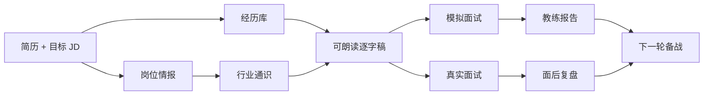

<div align="center">

<a href="https://greenroom.ungetsu.net/">
  
</a>

# greenroom · 候场

**把面试准备做到能张口说出来为止。**

七个 Agent Skills、163 个公开岗位条目、一套开放的 Markdown 工作台契约。<br>
把简历和目标 JD 交给 Agent，拿回岗位情报、经历库、可朗读的逐字稿、模拟面试和复盘。

[](https://greenroom.ungetsu.net/)
[](LICENSE)
[](https://github.com/YunyueLi/greenroom/releases)
[](README.md)

[打开官方产品](https://greenroom.ungetsu.net/) · [30 秒开始](#30-秒开始) · [看示例工作台](examples/demo-workspace/) · [读格式契约](docs/workspace-spec.md)

</div>

<a href="https://greenroom.ungetsu.net/">
  
</a>

> [!IMPORTANT]
> **这个仓库是 greenroom core，不是可自托管的 Greenroom 产品版。** 开源层提供 Skills、公共知识库、工作台契约和只读参考服务；完整产品界面、账号与同步、托管模型能力、额度与支付只由[官方产品](https://greenroom.ungetsu.net/)提供。

## 两种使用方式

| | **官方 Greenroom** | **greenroom core** |
| --- | --- | --- |
| **适合你，如果** | 想登录即用，完成从简历、岗位到模拟和临场的一站式流程 | 想在自己的 Agent 中运行方法论，或开发兼容工具 |
| **包含** | 完整产品 UI、账号同步、托管模型、实战提词、产品级模拟面试、持续运维 | 7 个 Skills、163 个岗位条目、Markdown 契约、示例工作台、只读参考服务 |
| **运行位置** | 官方托管服务；**不提供自托管版** | Skills 运行在你的 Agent 中；工作台文件保存在你的电脑上 |
| **许可** | 产品层保留所有权利 | Core 按 AGPL-3.0 开源 |
| **开始** | [打开产品](https://greenroom.ungetsu.net/) | [安装 Skills](#30-秒开始) |

## 30 秒开始

在 Claude Code 中安装版本化插件：

```text
/plugin marketplace add YunyueLi/greenroom
/plugin install greenroom@greenroom
```

或者安装到任何支持 Agent Skills 的工具：

```bash
npx skills add YunyueLi/greenroom
```

然后直接告诉 Agent：

> 下周二面 Acme 的 AI 产品经理。这是我的简历和 JD，请帮我完整备战。

`greenroom` 会选择需要的技能并写出一个工作台文件夹。你也可以缩小任务：

> 只做岗位情报。<br>
> 把这三段经历改成能直接回答的逐字稿。<br>
> 按二面强度陪我模拟一轮，结束后给教练报告。

## 从简历到下一轮



greenroom 的产出不是散落的聊天记录。岗位变化、模拟结果和面后复盘都会回到同一份工作台，成为下一轮的输入。

## 为什么是 greenroom

**答案，不是提纲。** 多数准备工具给出几条要点，最难的那一步——在压力下把要点变成完整句子——仍然留给你。greenroom 直接产出第一人称、能说出口的逐字稿。

**数字带口径，判断带依据。** 经历中的每个关键数字都要写清统计范围与来源。被追问时，你接住的是自己核过的事实，不是临场编出的说法。

```markdown
上线以来，自助解决率从 31% 提升到 52%，客服人力成本下降 18%。

**数字出处**
- 31% → 52%：口径为“未转人工且 24 小时内未重复进线”
- 18%：同口径月份的人力排班成本对比
```

**文件属于你。** 简历、岗位、经历卡、逐字稿和复盘都保存在普通 Markdown 文件中。契约公开、可审阅、可迁移，不依赖某个专有导出格式。

## 七个 Skills

| Skill | 产出 |
| --- | --- |
| [`greenroom`](skills/greenroom/) | 入口：理解目标，运行完整流程或路由到单个步骤 |
| [`job-intel`](skills/job-intel/) | 拆解 JD，调研公司与面试官，预测下一轮考点 |
| [`story-bank`](skills/story-bank/) | 把真实经历整理成可复用、数字有出处的经历卡 |
| [`industry-brief`](skills/industry-brief/) | 补齐行业、公司和岗位通识，形成可引用的阅读材料 |
| [`interview-script`](skills/interview-script/) | 把事实与判断写成第一人称、可朗读的完整回答 |
| [`mock-interview`](skills/mock-interview/) | 扮演面试官连续追问，评分并生成教练报告 |
| [`debrief`](skills/debrief/) | 还原刚结束的面试，把反馈转成逐字稿修订清单 |

## 工作台长什么样

```text
my-greenroom/
├── profile.md                  # 候选人档案
├── resume.md                   # 简历事实底本
├── story-bank.md               # 可复用经历卡
├── library/                    # 行业通识、调研与参考阅读
└── jobs/<公司-岗位>/
    ├── job.md                  # JD 与岗位进程
    ├── intel.md                # 公司、面试官与考点预测
    ├── script.md               # 第一人称逐字稿
    └── rounds/                 # 备战稿、模拟报告与面后复盘
```

[`examples/demo-workspace/`](examples/demo-workspace/) 提供一份完整示例：格式和流程都是真实的，人物与公司是虚构的。

## 公共岗位知识库

[`knowledge/`](knowledge/) 当前包含 **163 个岗位条目**，分布在 **27 个职能与行业分组**中。每个条目围绕真实面试判断组织：岗位心智模型、基准线、典型战例、强弱候选人的分水岭、高频题与追问链。

知识库不包含候选人个人数据。`industry-brief` 会先检索这里，再补充增量调研；公共知识越完整，每位新用户的冷启动就越快。

## 在开放契约上开发

工作台格式是公开契约，不是 Greenroom 的内部实现细节。任何兼容工具都可以直接读文件，或通过本仓库的参考服务读取同一份数据。

| 资源 | 用途 |
| --- | --- |
| [`docs/workspace-spec.md`](docs/workspace-spec.md) | 目录、frontmatter、题卡格式与 HTTP 取数约定 |
| [`docs/realtime-bridge.md`](docs/realtime-bridge.md) | 将工作台接入阅读器、检索工具或自有客户端 |
| [`serve.py`](serve.py) | 基于 Python 标准库的只读参考服务 |
| [`tools/workspace_codec.py`](tools/workspace_codec.py) | Markdown 工作台与结构化数据之间的转换工具 |

```bash
git clone https://github.com/YunyueLi/greenroom.git
cd greenroom
./start.sh ~/my-greenroom
```

参考服务只监听 `127.0.0.1:8765`，提供工作台读取端点；它没有产品界面、账号系统或模型生成接口，也不需要 API key。

## 开源边界

| **这个仓库有** | **这个仓库没有** |
| --- | --- |
| Agent Skills 与提示方法 | 官方产品 UI 与品牌资产 |
| 公开岗位知识库 | 账号、云同步、额度和支付 |
| Markdown 工作台契约 | 托管模型代理与产品服务端 |
| 只读参考服务和兼容工具 | 实战提词、产品级模拟评分和一键生成的服务端点 |
| 虚构示例工作台 | 可部署或可转售的 Greenroom 产品版 |

你可以运行、修改、贡献 greenroom core，也可以基于公开契约开发兼容工具；但不能把这个仓库描述成官方 Greenroom 产品或官方自托管版。品牌使用规则见 [`TRADEMARK.md`](TRADEMARK.md)。

## 隐私

工作台首先是你电脑上的文件夹。Agent 或模型服务会接触哪些内容，取决于你使用的 Agent 与模型提供商；在交出真实简历、薪资、公司内部信息前，请检查它们的数据政策。

不要把真实候选人材料、API key、生产日志或未公开公司信息提交到本仓库或任何其他公开仓库。示例与测试请使用虚构数据。

## 贡献与许可

欢迎贡献 Skills、公开岗位知识、契约改进、示例与兼容工具。开始前请阅读 [`CONTRIBUTING.md`](CONTRIBUTING.md)。

greenroom Community Edition 按 [GNU Affero General Public License v3.0](LICENSE) 授权。greenroom 名称、logo、wordmark、域名及容易混淆的品牌使用由 [`TRADEMARK.md`](TRADEMARK.md) 管理。

<div align="center">

**上台之前，把每一句话备好、对好。**

[打开官方产品](https://greenroom.ungetsu.net/) · [安装 greenroom core](#30-秒开始) · [参与贡献](CONTRIBUTING.md)

</div>
